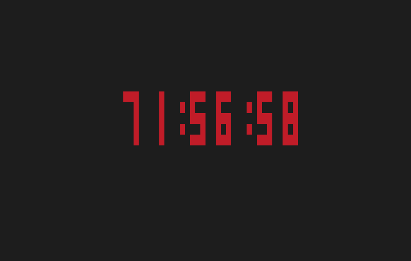

# timer-C
 being able to create a timer that can be displayed on the terminal

##  How to execute it everywhere

For that, you just need to execute `make run_bin` so it will build the file then copy it in your /usr/local/bin folder.

After that you'll be able to execute everywhere

## Syntax

type `timer -h <number> -m <number> -s <number>`
 and you'll have a timer that will decrement each second (like a timer).

 it's pretty versatile, you don't need to type all the argument as `timer -m 120` will display a timer of 2 hours. 
 The max you can have is 99 hours 59 minutes and 59 seconds.
